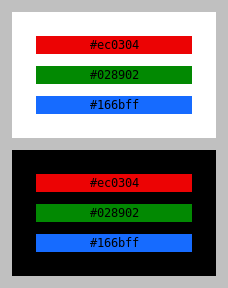
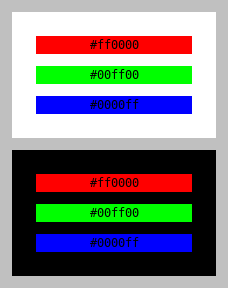

RGB Luminance Experiment
========================
The objective of this experiment is to find three shades: one of red,
one of green, and one of blue such that they have approximately equal
contrast on white as well as black background.

The definitions of luminance and contrast ratio as defined in
[Techniques for WCAG 2.0](G17) were used in this experiment.

[G17]: https://www.w3.org/TR/WCAG20-TECHS/G17.html#G17-tests

Code
----
The code in [`lum.py`](lum.py) demonstrates a few things:

  - When a color has equal contrast on white and black backgrounds, its
    luminance must be sqrt(x^2 + x) - x where x = 0.05 as specified in
    the WCAG 2.0 documentation.

    This formula is obtained by solving the equation obtained from
    setting the contrast ratio of the color on white background equal to
    that of the color on black ground, i.e., the equation:

    (luminance(white) + x) / (luminance(color) + x) =
    (luminance(color) + x) / (luminance(black) + x).

    We know that luminance(white) = 1 and luminance(black) = 0. Let
    L = luminance(color). Now solving (1 + x) / L = (L + x) / L, we get:

    L = sqrt(x^2 + x) - x.

    For x = 0.05 as defined in the WCAG 2.0 document, this turns out to
    be:

    L = 0.1791 approximately.

  - The shades `#ec0304` of red, `#028902` of green and `#166bff` of
    blue have a luminance of 0.1791 approximately with a contrast ratio
    of 4.58 approximately with respect to both white and black
    backgrounds.

  - An HTML file named `color-preview.html` is generated that provides a
    visual demonstration of the colors on both white and black
    backgrounds.

Result
------
The screenshot below shows how the three shades look like on white and
black backgrounds:

The contrast of the colors on both backgrounds look good to my eyes.
For comparison, here is how pure red, green, and blue shades look:

The green here is too bright and contrasts poorly with white background.
The blue here is too dark and contrasts poorly with black background.

License
-------
This is free and open source software. You can use, copy, modify,
merge, publish, distribute, sublicense, and/or sell copies of it,
under the terms of the MIT License. See [LICENSE.md][L] for details.

This software is provided "AS IS", WITHOUT WARRANTY OF ANY KIND,
express or implied. See [LICENSE.md][L] for details.

[L]: LICENSE.md
